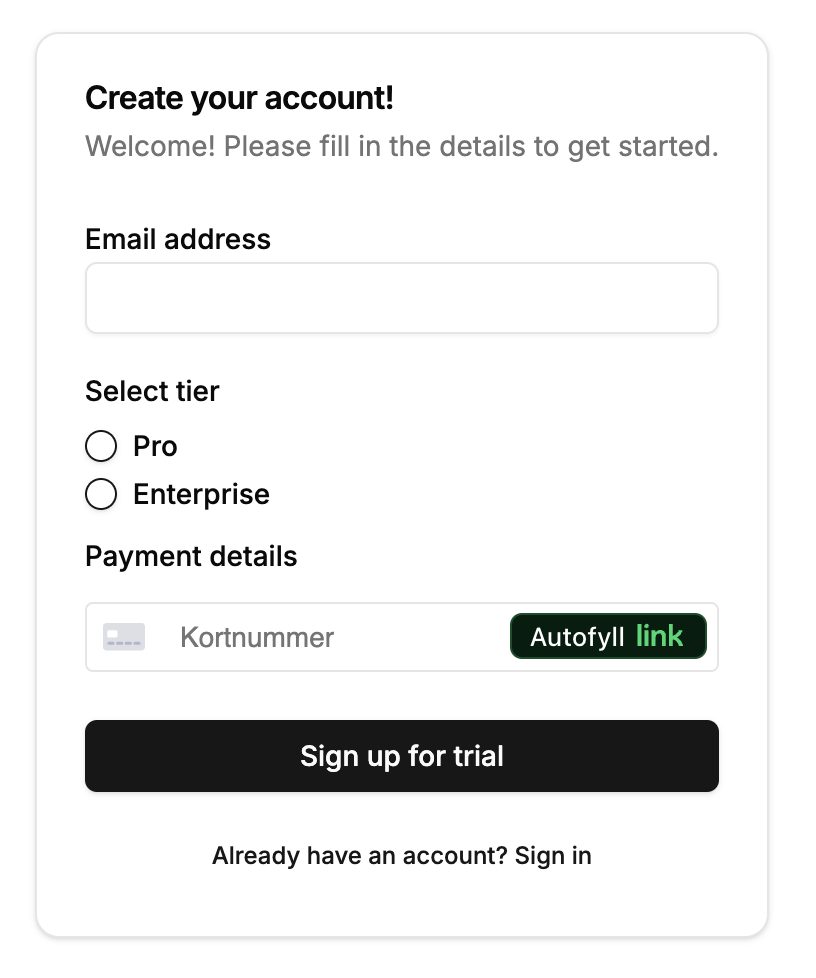
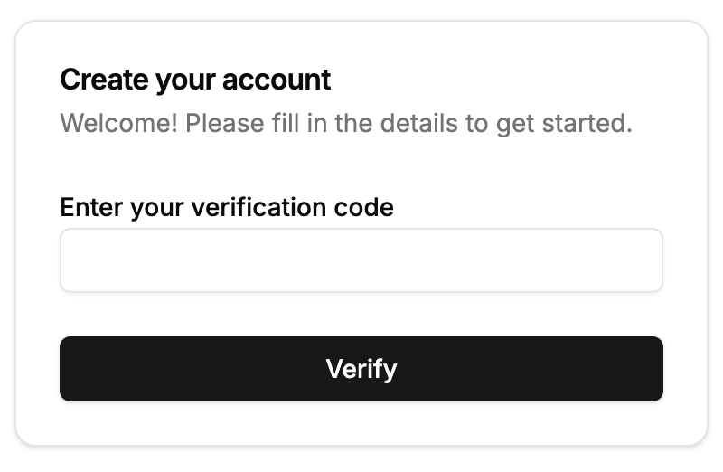
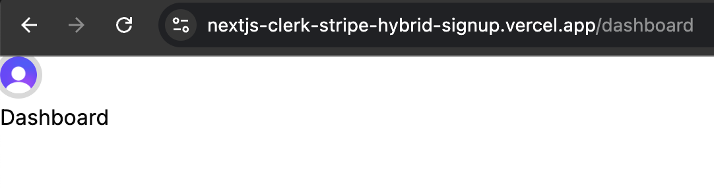

# Hybrid Sign-Up and Subscribe Form with Stripe

This repository demonstrates how to build a hybrid sign-up and subscription form using [Clerk](https://clerk.com) for authentication and [Stripe](https://stripe.com) for payment processing. The form allows users to sign up and subscribe to a service in a single, streamlined process.

  

    
    
    
  

- **Live site**: https://nextjs-clerk-stripe-hybrid-signup.vercel.app/

## Features

- **User Authentication**: Integrates Clerk for user sign-up and login.
- **Payment Integration**: Uses Stripe to handle subscription payments.
- **Hybrid Form**: Combines user registration and subscription in one form.
- **UI/Component Library**: [shadcn](https://ui.shadcn.com/)
